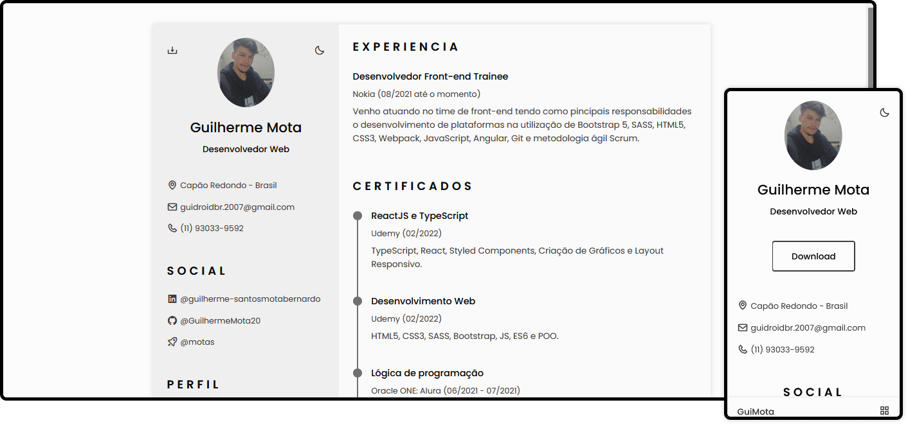

<h1 align="center">
    <strong>Currículo</strong>
</h1>

 

  

## 🚀 Tecnologias

Esse projeto foi desenvolvido com as seguintes tecnologias:

- HTML5
- CSS3
- JavaScript

## 💻 Projeto

Esse é meu currículo virtual, feito no intuito de facilitar o acesso dos recrutadores. Principal objetivo é ter como gerar um PDF em tempo real.

## 🔖 Layout

100% autoral.

## Licença

Esse projeto está sob a licença MIT. Veja o arquivo [LICENSE](LICENSE.md) para mais detalhes.

